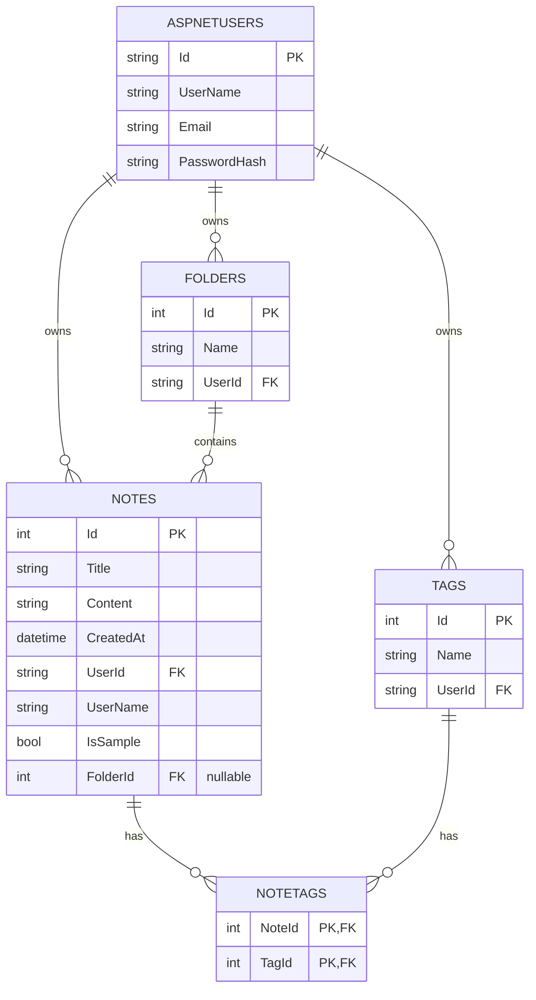

# Entity-Relationship Diagram

The database has five tables: the four app tables (`Notes`, `Folders`, `Tags`, `NoteTags`) plus ASP.NET Core Identity's `AspNetUsers` table. 

## Table notes

- **AspNetUsers** — handled entirely by ASP.NET Core Identity (`IdentityDbContext<IdentityUser>`), stores accounts and hashed passwords.
- **Notes** — a study note. `FolderId` is nullable; if you delete a folder, its notes just get `FolderId` set to `null` instead of being deleted too (`DeleteBehavior.SetNull` in `ApplicationDbContext.OnModelCreating`). `IsSample` marks the notes shown publicly on the home page for logged-out visitors, and those rows use an empty `UserId`.
- **Folders** — a per-user grouping for notes; one folder can hold many notes.
- **Tags** — a per-user label; a note can have several tags and a tag can be on several notes.
- **NoteTags** — the many-to-many join table between `Notes` and `Tags`, with a composite primary key of (`NoteId`, `TagId`).
